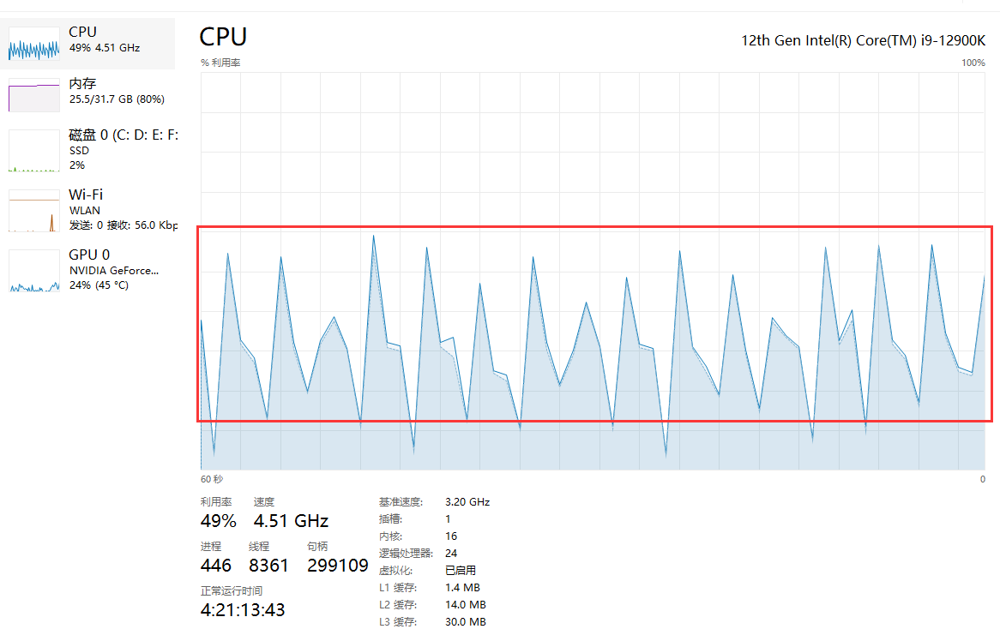
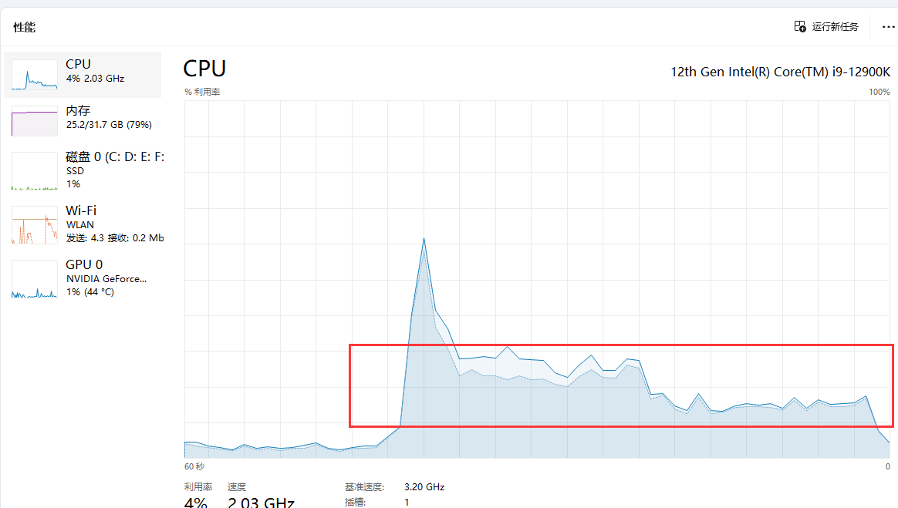

# rediQ
一个go+redis开发的定时过期推送队列


特征&原理
========

- 使用redis的sortedset数据结构，以过期时间为score，消息内容为value，实现定时过期推送
- 使用桶的思想，将过期时间相同的消息放在同一个桶中（使用hash分桶），以便于批量处理
- 使用gin框架作为数据接入，提供http接口，实现消息的增删改查
- 使用goroutine处理，提供高性能并发的消息推送
- 更多特征，敬请期待

使用方法
=======
- 查看使用：`curl -XGET http://localhost:8080/`
- 推送消息：`curl -XPOST -d '{"key":"test","data":"hello world","age":10}' http://localhost:8080/put`
- 取消消息：`curl -XGET http://localhost:8080/cancel/test`
- 获取统计数据：`curl -XGET http://localhost:8080/cancel/getall`

基准测试
=========
并发写入:

修改测试代码utils.MutilPutTest()并发数量然后使用
```go
go test -run="mutil_test.go" -test.bench="BenchmarkMutilAdd" -test.benchtime='3s' -timeout='3s' -benchmem
```
单次1w并发写入：
基本上内存在%25-%50之间，内存基本上无变化

基准测试结果：
```go
goos: linux
goarch: amd64
pkg: gosuc/go-timequeue
cpu: 12th Gen Intel(R) Core(TM) i9-12900K
BenchmarkMutilAdd-24            启动测试进程
当前并发次数: 1 总请求数量: 99 耗时: 0.066020502 秒
测试结束
启动测试进程
当前并发次数: 1 总请求数量: 5444 耗时: 1.5018088600000001 秒
测试结束
启动测试进程
当前并发次数: 1 总请求数量: 12953 耗时: 3.442506511 秒
测试结束
12954            266087 ns/op           17445 B/op        132 allocs/op
PASS
ok      gosuc/go-timequeue      5.048s

写入性能：
qps  = 12953 / 3.442506511 = 3763.5 (总请求数量/总耗时，平均每个请求耗时0.27毫秒)
iops = 12953 / 5.048 = 2566.5 (总操作数12953/总耗时5.048)
```

消费推送:

先写入100w条数据，然后再启动下面命令，测试并发读取
```go
go test -run="rediq" -test.bench="BenchmarkMutilScan" -benchmem ./rediq
```
key数据大概在59w左右，内存基本上无变化，cpu基本上在%20-%30之间

基准测试结果：

因为使用异步处理的方式，所以无法很好的量化结果，但是根据时间和预期的key数量的比例，可以大概估算出消费性能为1w/s左右，主要还是看key过期的数量
```go
goos: linux
goarch: amd64
pkg: gosuc/go-timequeue/rediq
cpu: 12th Gen Intel(R) Core(TM) i9-12900K
BenchmarkMutilScan-24                  1        39169308984 ns/op       1972396904 B/op 34403578 allocs/op
--- BENCH: BenchmarkMutilScan-24
    rediq_test.go:35: 当前扫描总数: 0
    rediq_test.go:35: 当前扫描总数: 30193
        ... [output truncated]
PASS
ok      gosuc/go-timequeue/rediq        39.182s

```

依赖情况
========
- gin
- go-redis
- spaolacci/murmur3